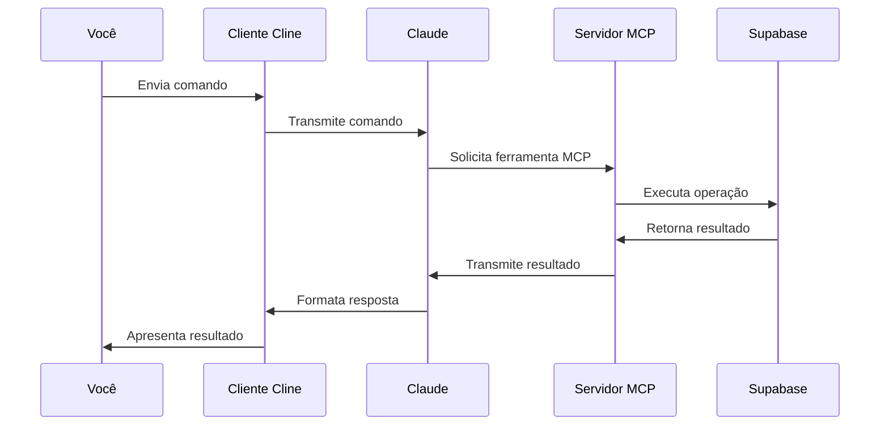

# Como o Claude Interage com o MCP (Model Context Protocol)

Este documento explica como o Claude interage com o MCP para acessar e manipular dados no Supabase.

## Arquitetura da Comunicação



## Fluxo de Comunicação

1. **Você → Cliente Cline**
   - Envia um comando ou pergunta
   - Exemplo: "Mostre os schemas do banco de dados"

2. **Cliente Cline → Claude**
   - Transmite seu comando
   - Fornece contexto e configurações

3. **Claude → Servidor MCP**
   - Analisa a solicitação
   - Escolhe a ferramenta apropriada
   - Envia uma solicitação estruturada

4. **Servidor MCP → Supabase**
   - Processa a solicitação
   - Executa a operação no Supabase
   - Aplica controles de segurança

5. **Supabase → Servidor MCP**
   - Retorna os resultados da operação

6. **Servidor MCP → Claude**
   - Transmite os resultados formatados

7. **Claude → Cliente Cline**
   - Interpreta os resultados
   - Formata uma resposta compreensível

8. **Cliente Cline → Você**
   - Apresenta a resposta formatada

## Formato das Solicitações MCP

Quando o Claude usa uma ferramenta MCP, ele envia uma solicitação estruturada:

```xml
<use_mcp_tool>
<server_name>github.com/alexander-zuev/supabase-mcp-server</server_name>
<tool_name>get_schemas</tool_name>
<arguments>
{}
</arguments>
</use_mcp_tool>
```

Esta solicitação especifica:
- O servidor MCP a ser usado
- A ferramenta específica desejada
- Os argumentos necessários para a ferramenta

## Exemplo de Interação

### 1. Listando Schemas do Banco

**Você solicita:**
```
"Mostre os schemas do banco de dados"
```

**Claude usa:**
```xml
<use_mcp_tool>
<server_name>github.com/alexander-zuev/supabase-mcp-server</server_name>
<tool_name>get_schemas</tool_name>
<arguments>
{}
</arguments>
</use_mcp_tool>
```

**Recebe:**
```json
{
  "results": [{
    "rows": [
      {
        "schema_name": "public",
        "total_size": "32 kB",
        "table_count": 2
      }
    ]
  }]
}
```

### 2. Consultando uma Tabela

**Você solicita:**
```
"Mostre os dados da tabela users"
```

**Claude usa:**
```xml
<use_mcp_tool>
<server_name>github.com/alexander-zuev/supabase-mcp-server</server_name>
<tool_name>execute_postgresql</tool_name>
<arguments>
{
  "query": "SELECT * FROM public.users LIMIT 5;"
}
</arguments>
</use_mcp_tool>
```

## Sistema de Segurança

O MCP implementa um sistema de segurança em camadas:

1. **Modo Seguro (Padrão)**
   - Permite apenas operações de leitura
   - Exemplo: SELECT, EXPLAIN

2. **Modo Não-Seguro**
   - Requerido para operações de escrita
   - Ativado com `live_dangerously`
   ```xml
   <use_mcp_tool>
   <server_name>github.com/alexander-zuev/supabase-mcp-server</server_name>
   <tool_name>live_dangerously</tool_name>
   <arguments>
   {
     "service": "database",
     "enable_unsafe_mode": true
   }
   </arguments>
   </use_mcp_tool>
   ```

3. **Confirmação para Operações Destrutivas**
   - Requerido para operações como DROP, TRUNCATE
   - Sistema de confirmação em duas etapas

## Vantagens desta Arquitetura

1. **Segurança**
   - Controle granular de operações
   - Sistema de permissões em camadas
   - Proteção contra operações destrutivas

2. **Flexibilidade**
   - Suporte a múltiplas operações
   - Extensível para novas funcionalidades
   - Adaptável a diferentes necessidades

3. **Confiabilidade**
   - Validação de operações
   - Tratamento de erros
   - Logs detalhados

4. **Facilidade de Uso**
   - Interface padronizada
   - Respostas estruturadas
   - Documentação clara
